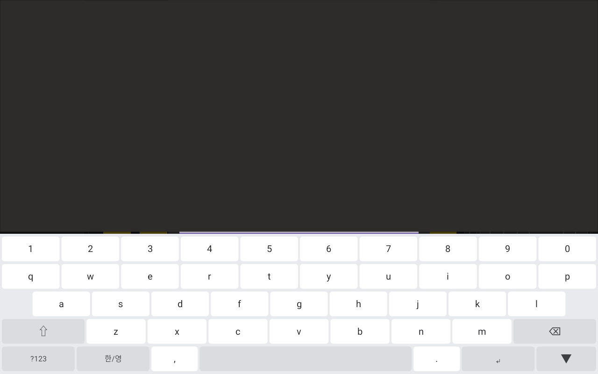
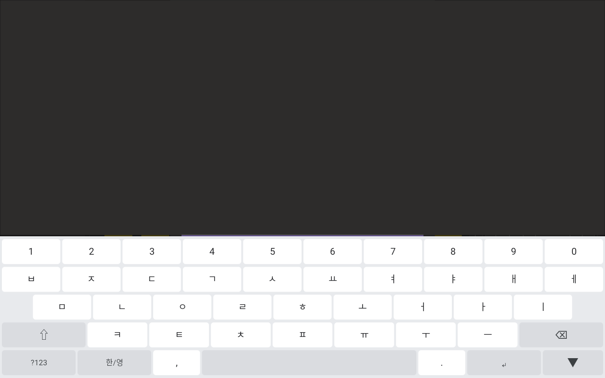
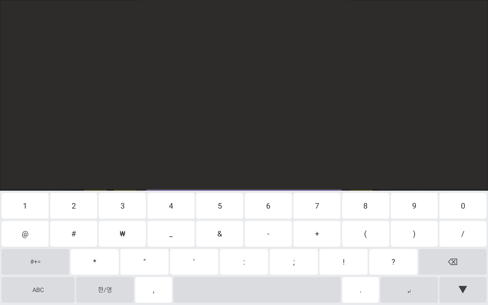
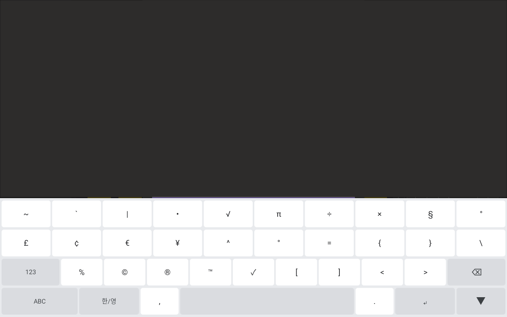
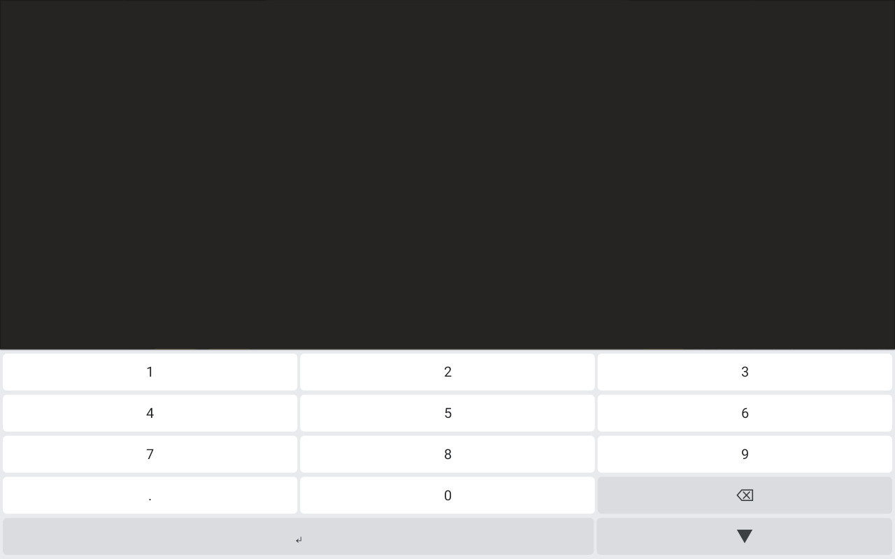

# android_hg_korean_kb

Android 10 / AOSP 10 (API 29)용 **한글·영문 QWERTY 소프트웨어 키보드(IME)** 프로젝트입니다.

일반 APK 설치뿐 아니라, AOSP 소스 트리에 포함해 시스템 이미지와 함께 빌드·배포하는 것을 목표로 합니다.

| 항목 | 값 |
|------|-----|
| 패키지 | `com.higenis.keyboard` |
| IME 서비스 | `com.higenis.keyboard.HGKeyboardService` |
| IME ID | `com.higenis.keyboard/.HGKeyboardService` |
| Soong 모듈 | `HGKeyboard` |
| AOSP 경로 (권장) | `packages/inputmethods/HGKeyboard/` |
| 외부 의존성 | 없음 (AndroidX / Material / Kotlin / 외부 JAR 미사용) |

---

## 주요 기능

- **한국어(두벌식) / 영어** QWERTY 레이아웃 및 한/영 전환
- Shift / Caps Lock, Backspace, Enter, Space, 숫자·특수문자(`?123`) 전환
- 한글 조합·분해 (복모음, 겹받침 포함)
- `inputType`에 따른 TEXT / NUMBER / PHONE 레이아웃
- 오프라인 동작 (INTERNET 권한 없음, 입력 내용 저장·전송 없음)

---

## 스크린샷

| | |
|:--:|:--:|
| <br>영문 QWERTY | <br>한글 두벌식 |
| <br>숫자·기호 (`?123`) | <br>추가 기호 (`#+=`) |
| <br>숫자 키패드 (NUMBER) | |

---

## 저장소 구조

```
android_hg_korean_kb/
├── README.md
├── .gitignore
├── img/                       # 키보드 스크린샷
└── source/
    └── hg_korean_kb/          # IME 모듈 본체
        ├── Android.bp         # AOSP Soong
        ├── aosp/              # product makefile, Settings overlay 등
        ├── app/               # IME 소스·리소스 (Gradle + AOSP 공용)
        ├── testapp/           # inputType 검증용 호스트 앱
        ├── tests/             # 호스트 JVM 단위 테스트
        ├── README.md          # AOSP 통합·검증 상세
        └── APK_TEST.md        # Gradle APK 빌드·기기 테스트
```

소스 루트는 `source/hg_korean_kb/` 입니다. AOSP에 넣을 때는 이 디렉터리를 `packages/inputmethods/HGKeyboard/` 로 복사하면 됩니다.

---

## 빌드 방법

소스는 **Gradle APK**와 **AOSP Soong**이 공유합니다. 상세 절차는 하위 문서를 참고하세요.

### 1) Gradle APK (기기 검증용)

요구사항: JDK 11+, Android SDK (`platforms;android-29`), `local.properties`에 `sdk.dir`

```bash
cd source/hg_korean_kb
# Windows
gradlew.bat assembleDebug
# Linux / macOS
./gradlew assembleDebug
```

| 모듈 | APK | 역할 |
|------|-----|------|
| `:app` | `app/build/outputs/apk/debug/app-debug.apk` | IME |
| `:testapp` | `testapp/build/outputs/apk/debug/testapp-debug.apk` | EditText 검증 호스트 |

설치·IME 활성화·수동 테스트 절차: [source/hg_korean_kb/APK_TEST.md](source/hg_korean_kb/APK_TEST.md)

### 2) AOSP Soong (시스템 이미지)

```bash
# AOSP 트리에 모듈 배치
cp -a source/hg_korean_kb packages/inputmethods/HGKeyboard

source build/envsetup.sh
lunch <product>-userdebug
m HGKeyboard
```

제품에 포함하려면 `PRODUCT_PACKAGES += HGKeyboard` 또는 `aosp/product/hgkeyboard.mk` inherit.

AOSP 통합·플래시·검증 체크리스트: [source/hg_korean_kb/README.md](source/hg_korean_kb/README.md)

---

## 아키텍처 요약

| 구성 요소 | 역할 |
|-----------|------|
| `HGKeyboardService` | `InputMethodService` 진입점 |
| `KeyboardController` / `KeyboardView` | 키 이벤트·UI |
| `KeyboardLayout` / `*Layouts` | QWERTY·숫자·기호 레이아웃 |
| `input/HangulComposer` | 두벌식 한글 조합 |
| `InputTypeHelper` | EditorInfo → TEXT / NUMBER / PHONE |
| `PreferencesHelper` | 언어 모드 등 최소 prefs (입력 문구 비저장) |

---

## 문서

| 문서 | 내용 |
|------|------|
| [source/hg_korean_kb/README.md](source/hg_korean_kb/README.md) | AOSP `Android.bp`, PRODUCT_PACKAGES, adb/ime 검증 |
| [source/hg_korean_kb/APK_TEST.md](source/hg_korean_kb/APK_TEST.md) | Gradle 빌드·설치·기기 테스트 |
| [source/hg_korean_kb/AOSP_DEFAULT_IME.md](source/hg_korean_kb/AOSP_DEFAULT_IME.md) | 기본 IME 설정 (기본값 연동) |
| [source/hg_korean_kb/tests/README.md](source/hg_korean_kb/tests/README.md) | 호스트 단위 테스트 |

---
## 보안·제약

- `INTERNET` / 스토리지 / 네트워크 권한 없음
- 입력 문자 영구 저장·클립보드 수집·텔레메트리 없음
- 릴리스 로그에 입력 문자 출력 금지 (`DebugLog.DEBUG` 기본 `false`)
- 공개 IME API만 사용 (`platform_apis` / privileged / platform 서명 불필요)